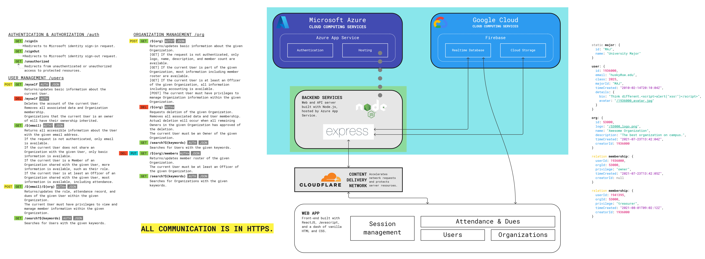

# Human Outsourcers: RSO Member Management App

By Jun Ahn, Patricia Ma, Scott Nguyen, and Jack Sui.

**For developers:** also read [development notes](DEVELOP.md).

## Project Description

Our target audience for the club member management app is college RSO officers
and administrators. We envision club officers to use our applications to easily 
manage various member status such as attendance, dues, membership status, etc.

Our audience will choose our application over their previous management methods
because we noticed that many RSOs track their attendance, club dues and
activities with Excel or other manual ways, which are not created for human
management purposes. We want to build a system that is actually useful for
current RSO's leaders to better manage their organizations and to save time
while doing so.

As a developer and a student, many of us are part of the RSOs on campus.
Based on our experiences, we observed that many RSO's on campus have a difficult
time managing members as they are either using excel or platforms not suitable
for member management.

## Technical Description

### Architectural Diagram

### User Stories

|Priority|User|Description|Technical Description|
|---|---|---|---|
|P0|As a Club Officer|I want a platform that I can use to manage my club |Website will be hosted on **Azure**, while the server side will be written in **Node.js** and **Express** framework. All information will be stored in **Firebase DB**, while communication is handled through **http protocol from the REST API**|
|P0|As a Club Officer|I want to be able to add club members information into my specific club |Use **post** to make appropriate updates to club user database. Information will be sent in **JSON** format, While requests will be handled from the backend|
|P0|As a Club Officer|On the platform I want to view all the members information| **Get** calls to members will allow officers to view member details|
|P0|As a Club Officer|I want to be able to change the club's information on the website (add and change club dues, and add officer roles)|Use **post** and **delete** to make appropriate updates about the club. Information will be sent in **JSON** format, While requests will be handled from the backend|
|P0|As a Club Officer|I want to track the dues/finances of my club members|There will be an button for marking a member when they have paid dues. This functionality will be handled using **POST** and **GET** requests|
|P1|As a Club Officer|I want to be able to access the app specifically for our club|Use **authentication** to create numerous accounts specific to the RSO and give authorization only to the RSO members|
|P2|As a Club Officer|I want to be able to check attendance of the members|Secretary can simply check attendance by clicking on the checkbox next to the member’s name, which will send a **POST** request to the **Firebase DB** to update attendance|
|P3|As a Club Officer|I want to be able to send out mass emails to all members|Officer can select members (all or specific) on the app which will send a **GET** request to **Firebase DB** to extract emails which then will send mass emails to the selected memebrs|

### Endpoints

- Authentication
  - /signin
    - Handle user sign in through Azure
  - /signout
    - Delete current user session and signs the user out
  - /error
    - Handle login and general server issues
  - /unauthorized
    - Deny access to non-UW emails

- Users: /user
  - Get - /
    - Gets info of all users on platform
  - Post - /
    - Posts user into the database
  - Delete - /
    - Remove user from database
  - Get/Post -  /email/details
    - {
      - email
      - username
    - }
    - Gets/Posts/Puts email/username of users

- Orgs: /org
  - Get - /
    - Gets all RSOs from the database
  - Post - /
    - Adds RSOs to the database
  - Delete - /
    - Deletes RSOs from the database
  - Get/Post - /dues
      - Get to retrieve RSO's due information
      - Post to update RSO's dues
  - Members: /members
    - Get/Post/Delete - /
      - Get/Post/Delete user information
    - Get/Post - /attendance
      - Update members attendance
